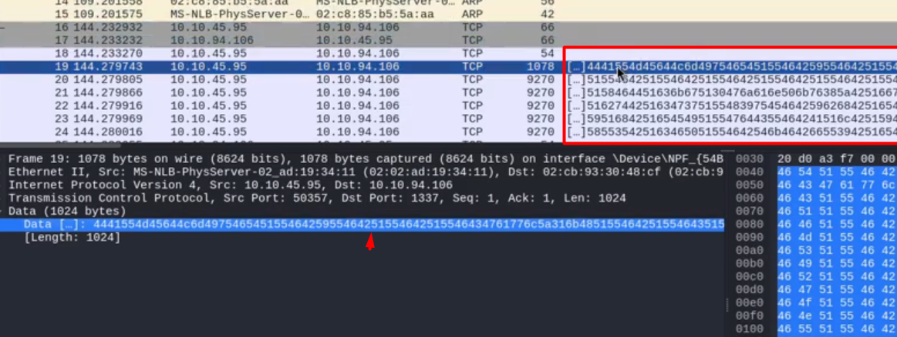

# Network Analysis

Initial PCAP inspection via Wireshark revealed:

- HTTP object export containing PowerShell script
- Hex-encoded IP address resolving to internal destination
- Repeated outbound connections to port 1337
- Large TCP stream (~390MB)

GUI-based stream reconstruction proved inefficient due to dataset size.

A decision was made to transition to CLI-based analysis using tshark.

