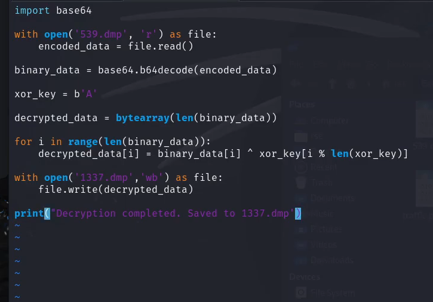

# Layered Obfuscation Reversal

Recovered stream required multiple decoding stages:

1. Hex → Binary conversion
2. Base64 decoding
3. XOR decryption (0x41 for port 1337)
4. Secondary XOR (0x42 for port 1338)

Recovered artifacts:

- Memory dump file
- KeePass database (.kdbx)

Layered simple transformations were effective in concealing the payload.

